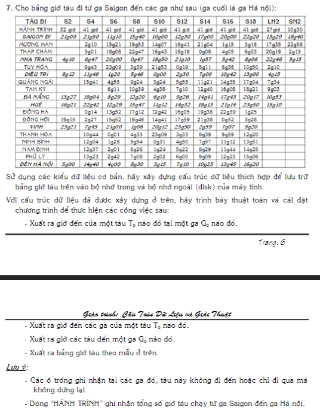

#include `<iostream>`
#include `<map>`
#include `<string>`
#include `<vector>`
#include `<fstream>`
#include `<sstream>`

using namespace std;

class TrainSchedule {
private:
    map<string, map<string, string>> schedule;

public:
    TrainSchedule() {
        // Khởi tạo dữ liệu lịch trình tàu
        schedule["S2"] = {{"Saigon", "21g00"}, {"Mường Mán", "22g53"}, {"Tháp Chàm", "0g01"}, {"Nha Trang", "4g10"},
                          {"Tuy Hòa", "8g12"}, {"Diêu Trì", "8g12"}, {"Quảng Ngãi", "13g31"}, {"Tam Kỳ", "14g52"},
                          {"Đà Nẵng", "16g25"}, {"Huế", "19g03"}, {"Đông Hà", "20g48"}, {"Đồng Hới", "23g21"},
                          {"Vinh", "1g55"}, {"Thanh Hóa", "10g44"}, {"Ninh Bình", "13g37"}, {"Nam Định", "14g45"},
                          {"Phủ Lý", "16g00"}, {"Đến Hà Nội", "5g00"}};

    // Thêm các tàu khác tương tự...
    }

    string getArrivalTime(const string& train, const string& station) {
        if (schedule.find(train) != schedule.end() && schedule[train].find(station) != schedule[train].end()) {
            return schedule[train][station];
        } else {
            return "Không có dữ liệu";
        }
    }

    map<string, string> getStationSchedule(const string& station) {
        map<string, string> stationSchedule;
        for (const auto& train : schedule) {
            if (train.second.find(station) != train.second.end()) {
                stationSchedule[train.first] = train.second.at(station);
            } else {
                stationSchedule[train.first] = "Không có dữ liệu";
            }
        }
        return stationSchedule;
    }

    map<string, string> getTrainSchedule(const string& train) {
        if (schedule.find(train) != schedule.end()) {
            return schedule[train];
        } else {
            return {{"Không có dữ liệu", "Không có dữ liệu"}};
        }
    }

    void saveToCSV(const string& filename) {
        ofstream file(filename);
        if (file.is_open()) {
            // Ghi tiêu đề
            file << "Ga";
            for (const auto& train : schedule) {
                file << "," << train.first;
            }
            file << "\n";

    // Ghi dữ liệu
            vector`<string>` stations = {"Saigon", "Mường Mán", "Tháp Chàm", "Nha Trang", "Tuy Hòa", "Diêu Trì",
                                       "Quảng Ngãi", "Tam Kỳ", "Đà Nẵng", "Huế", "Đông Hà", "Đồng Hới", "Vinh",
                                       "Thanh Hóa", "Ninh Bình", "Nam Định", "Phủ Lý", "Đến Hà Nội"};
            for (const string& station : stations) {
                file << station;
                for (const auto& train : schedule) {
                    file << "," << train.second.at(station);
                }
                file << "\n";
            }
            file.close();
        }
    }
};

void printArrivalTime(TrainSchedule& ts, const string& train, const string& station) {
    string arrivalTime = ts.getArrivalTime(train, station);
    cout << "Giờ đến của tàu " << train << " tại ga " << station << " là " << arrivalTime << ".\n";
}

void printStationSchedule(TrainSchedule& ts, const string& station) {
    map<string, string> stationSchedule = ts.getStationSchedule(station);
    cout << "Giờ đến tại ga " << station << ":\n";
    for (const auto& entry : stationSchedule) {
        cout << "Tàu " << entry.first << ": " << entry.second << "\n";
    }
}

void printTrainSchedule(TrainSchedule& ts, const string& train) {
    map<string, string> trainSchedule = ts.getTrainSchedule(train);
    cout << "Lịch trình của tàu " << train << ":\n";
    for (const auto& entry : trainSchedule) {
        cout << "Ga " << entry.first << ": " << entry.second << "\n";
    }
}

int main() {
    TrainSchedule ts;

    // Lưu vào CSV
    ts.saveToCSV("train_schedule.csv");

    // Ví dụ sử dụng
    printArrivalTime(ts, "S2", "Huế");
    printStationSchedule(ts, "Huế");
    printTrainSchedule(ts, "S2");

    return 0;
}
