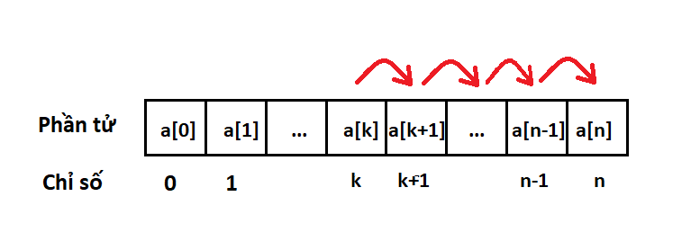

## Bài tập.

Nhập vào một số nguyên dương `n`, và `n` số nguyên lần lượt là các phần tử trong dãy `a`. Tiếp theo nhập vào hai số nguyên là `k` và `x` (`0 ≤ k ≤ n`).

Hãy chèn phần tử có giá trị `x` vào dãy `a`, ở trước phần tử có chỉ số `k` và sau phần tử có chỉ số `k-1`. In mảng kết quả ra màn hình, mỗi số cách nhau bởi một khoảng trắng.

**Ví dụ:**

* Test mẫu 1:

  | **Input**          | **Output** |
  | ------------------------ | ---------------- |
  | 4<br />1 2 3 4<br />1 10 | 1 10 2 3 4       |

  Với `n = 4, a = [1, 2, 3, 4], k = 1, x = 10` thì kết quả mong muốn là: `"1 10 2 3 4 ".`
* Test mẫu 2:

  | **Input**         | **Output** |
  | ----------------------- | ---------------- |
  | 3<br />1 2 3<br />3 123 | 1 2 3 123        |

  Với `n = 3, a = [1, 2, 3], k = 3, x = 123` thì kết quả mong muốn là: `"1 2 3 123 "`.

## Hướng dẫn bài tập.

Mỗi phần tử trong mảng đều có một chỉ số cố định, để chèn một phần tử `x` vào trước phần tử có chỉ số `k` cho trước không phải cứ gán `a[k] = x` là được, vì nếu gán về thì phần tử `a[k]` cũ sẽ bị mất.

Ý tưởng cho việc chèn phần tử trong mảng như sau:

Ta thấy rằng sau khi chèn vào dãy một phần tử thì chắc chắn số lượng phần tử sẽ tăng lên `1` đơn vị, các phần tử có chỉ số từ `0` đến `k-1` vẫn giữ nguyên, còn các phần tử từ chỉ số `k` đến `n-1` sẽ tăng chỉ số lên `1`, để làm được như vậy ta phải gán `a[i] = a[i-1]` và phải chọn vòng lặp cho hợp lý.

Nhiều bạn đã thử biến đổi như sau:

```cpp
	for (int i = k+1; i <= n; i++){
		a[i] = a[i-1];
	}
	a[k] = x;
	n++;
```

Nhưng kết quả sẽ cho ra là sai, bởi vì các giá trị cũ bị mất đi, ví dụ như sau: nếu gán `a[4] = a[3]` sau đó là gán `a[5] = a[4]` thì giá trị `a[4]` cũ không còn nữa mà nó đang giữ giá trị của `a[3]`.

Để giải quyết vấn đề trên ta sẽ thay đổi vòng for thành như sau:

```cpp
	for (int i = n; i >= k+1; i--){
		a[i] = a[i-1];
	}
	a[k] = x;
	n++;
```


