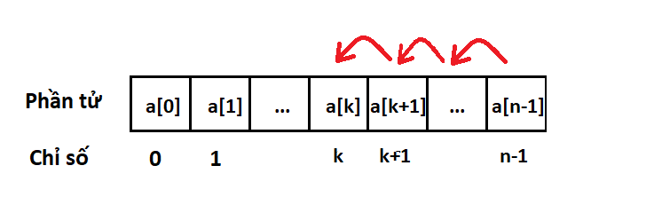

### Bài tập

Nhập vào một số nguyên dương n, và n số nguyên lần lượt là các phần tử trong dãy a. Tiếp theo nhập vào số nguyên là k (0 ≤ k < n).

Hãy xóa phần tử có chỉ số k ở trong dãy đó. In mảng kết quả ra màn hình, sau mỗi phần tử có đúng một khoảng trắng.

**Ví dụ:**
- Test mẫu 1:

  | Input | Output |
  | --- | --- |
  | 4 1 2 3 4 1 | 1 3 4 |

  Với n = 4, a = [1, 2, 3, 4], k = 1 thì kết quả mong muốn là: "1 3 4".

- Test mẫu 2:

  | Input | Output |
  | --- | --- |
  | 3 1 2 3 2 | 1 2 |

  Với n = 3, a = [1, 2, 3], k = 2, thì kết quả mong muốn là: "1 2 ".

### Hướng dẫn bài tập.
Ý tưởng:
Ta thấy rằng khi xóa một phần tử trong mảng thì số phần tử trong mảng bị giảm đi 1 đơn vị, tất cả những phần tử từ chỉ số 0 đến k-1 đều giữ nguyên, các phần tử từ chỉ số k đến n-1 sẽ giảm chỉ số đi 1 đơn vị (a[i] = a[i+1]).

Chú ý: nhớ dùng vào lặp hợp lý, để không bị mất giá trị các phần tử trong mảng.

