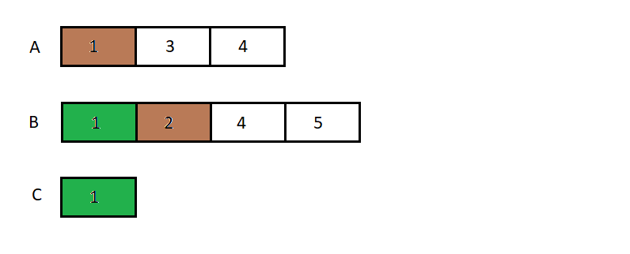
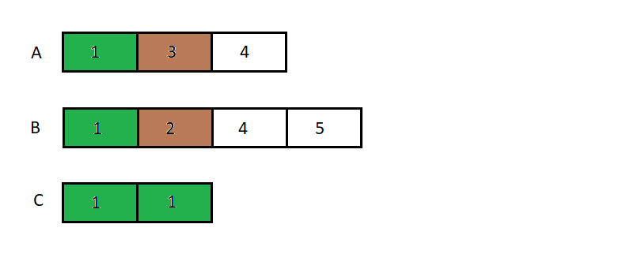
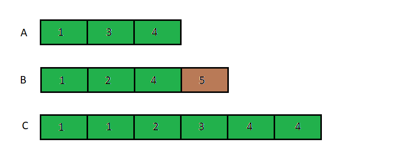
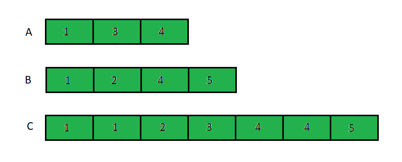

### Bài tập
Cho dãy a gồm n số nguyên, và dãy b gồm m số nguyên, cả hai dãy đều được sắp xếp không giảm.
Hãy gộp hai dãy thành một dãy c, sao cho dãy c cũng là dãy không giảm. In dãy c ra màn hình, sau mỗi phần tử có đúng một dấy cách.

Ví dụ:
- Test mẫu 1:
  
  | Input | Output |
  |-------|--------|
  |3 1 3 4 4 1 2 3 5 | 1 1 2 3 3 4 5 |

  Với a = [1, 3, 4] và b = [1, 2, 4, 5] thì kết quả mong muốn là: "1 1 2 3 4 4 5 ".

- Test mẫu 2:

  | Input | Output |
  |-------|--------|
  |3 1 2 3 3 2 3 4 | 1 2 2 3 3 4 |

  Với a = [1, 2, 3] và b = [2, 3, 4] thì kết quả mong muốn là: "1 2 2 3 3 4 ".

### Hướng dẫn bài tập.
Tạo dãy c rỗng, lần lượt thêm các phần tử vào dãy c theo thứ tự từ bé đến lớn, do dãy a và b đã được sắp xếp, nên ta chỉ cần so sánh 2 giá trị là 2 giá trị nhỏ nhất của mỗi dãy.

Ví dụ với bài trên.
Lúc đầu ta sẽ xét hai số là a[0] và b[0] thêm số nhỏ hơn và dãy c. ta thấy a[0] >= b[0] nên ta lấy giá trị nhỏ hơn là b[0] thêm vào dãy c.

Xét hai số là a[0] và b[1] để thêm số nhỏ hơn và dãy c. Ta thấy a[0] < b[1] nên ta thêm a[0] và dãy c.

Tiếp tục tương tự như vậy đến khi 1 trong 2 dãy hết phần tử để duyệt.

Lúc này 1 trong 2 dãy đã hết phần tử, ta thêm tất cả phần tử của dãy còn lại vào dãy c.
