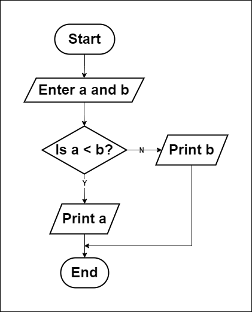

# Min of Two Numbers?

## How to solve a problem:
1. Understand the problem.
   - Find the minimum of two numbers, `a` and `b`.
2. Find input.
    - Enter the two numbers: `a` and `b`.
3. Find solution.
    - Minimum = `a` if `a < b` else `b`. (This is the mathematical operation to find the minimum.)
    - Minimum = `b` if `a - b > 0` else `a`. (This is another way to find the minimum.)
4. Convert solution to code.
    - Use a programming language to implement the solution.

## Flowchart

## Pseudocode
1. Input `a` and `b`.
2. If `a < b`
        Print `a`.
   Else
        Print `b`.
3. End.