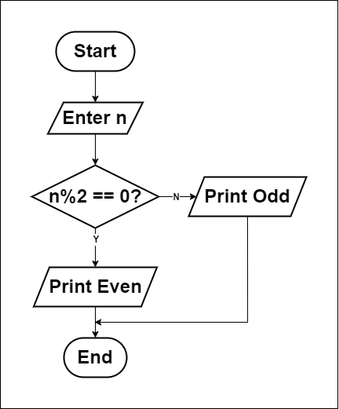

# Is number odd or even?

## How to solve a problem:
1. Understand the problem.
   - Check a number to see if it is odd or even.
2. Find input.
   - Enter a number.
3. Find solution.
   - If the number is divisible by 2, it is even.
   - If the number is not divisible by 2, it is odd.
4. Convert solution to code.
   - Use a programming language to implement the solution.

## Flowchart

## Pseudocode
1. Input `n`.
2. If `n % 2 == 0`
        Print "Even".
   Else
        Print "Odd".
3. End.