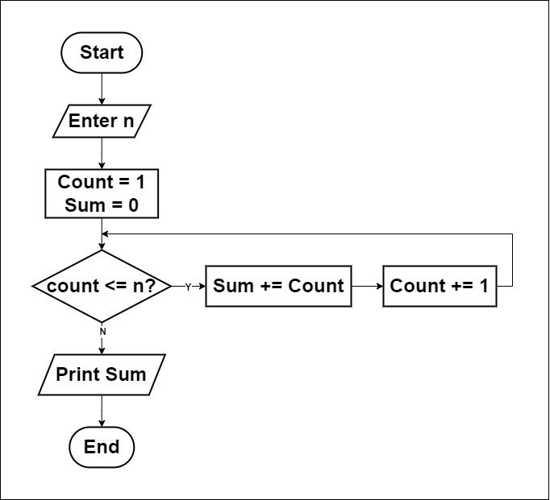
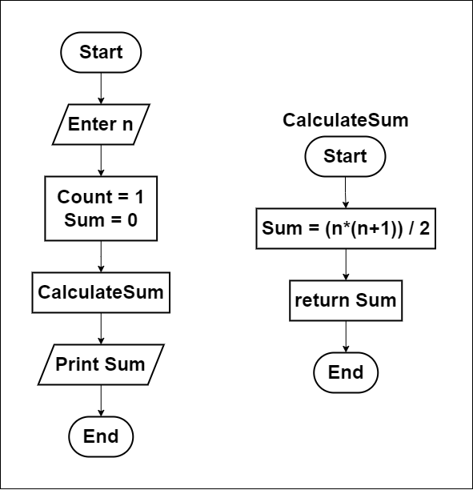

# Sum of Numbers from 1 to N?

## How to solve a problem:
1. Understand the problem.
   - Calculate the sum of all numbers from 1 to N.
   - Identify the input (N) and output (sum) requirements.
2. Find input.
   - Enter a number N.
3. Find solution.
    - Initialize variables to mark the start: count = 1, sum = 0.
4. Convert solution to code.
   - Use a programming language to implement the solution.
5. Optimization.
   - Use the formula for the sum of the first N natural numbers:
   $$\text{sum} = \frac{n \cdot (n + 1)}{2}$$
  
## Flowchart
1. Using a loop to iterate from 1 to N:  
   &emsp;
2. Using formulaic approach to calculate the sum directly:  
   &emsp;

## Pseudocode
1. Input `n`.
2. `count` = 1, `sum` = 0.
3. While `count` <= n
        `sum += count`
        `count += 1`
4. Print `sum`.
5. End.
