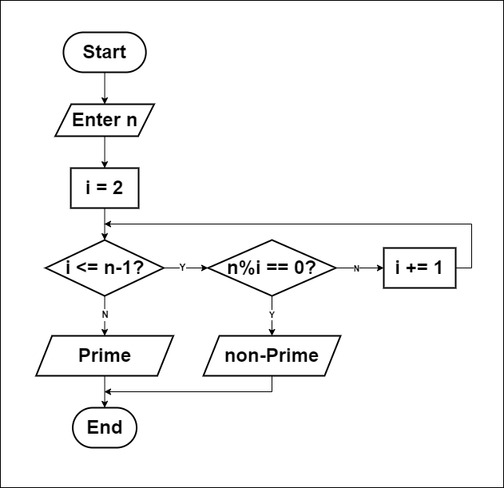

# Is number Prime or not?

## How to solve a problem:
1. Understand the problem.
   - Determine if a number is prime.
2. Find input.
   - Enter a number `n`.
3. Find solution.
   - If `n` is less than 2, it is not a prime number.
   - If `n` equals 2, it is a prime number.
   - If `n` is divisible by any number from 2 to `n-1`, it is not a prime number.
   - If `n` is not divisible by any such number, it is a prime number.
4. Convert solution to code.
   - Use a programming language to implement the solution.
5. Optimization
   - Instead of checking all numbers from 2 to `n-1`, check only up to the square root of `n`, as if `n` is divisible by any number greater than its square root, it would have a corresponding factor less than its square root.
   - Time complexity is O(sqrt(n)), which is faster than O(n). 
     - E.g., for `n = 100`, we only check up to `10` instead of `99`.

## Flowchart

## Pseudocode
1. Input `n`.
2. i = 2.
3. While i <= (n - 1)
      If n % i == 0
         Print "Non Prime"
         End.
      Else
         i += 1
4. Print "Prime"
5. End.