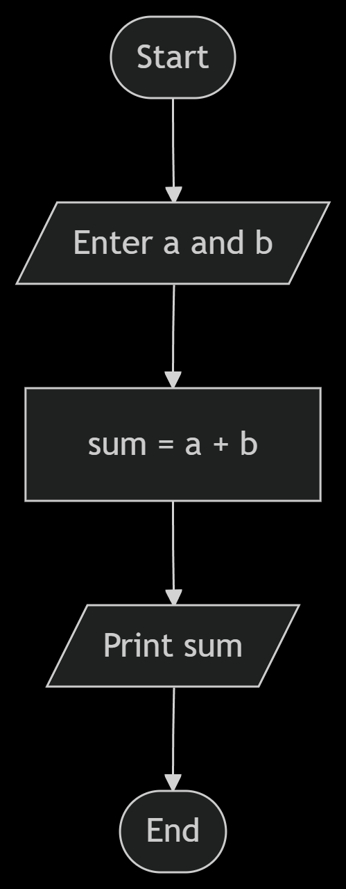

# Find sum of two numbers : a & b?

## How to solve a problem:
1. Understand the problem.
   - Find the sum of two numbers `a` and `b`.
2. Find input.
   - Enter two numbers: `a` and `b`.
3. Find solution.
   - Sum = `a` + `b`. (This is the mathematical operation to find the sum.)
4. Convert solution to code.
   - Use a programming language to implement the solution.

## Flowchart

## Pseudocode
1. Input `a` and `b`.
2. Sum = `a` + `b`.
3. Print `sum`.
4. End.
