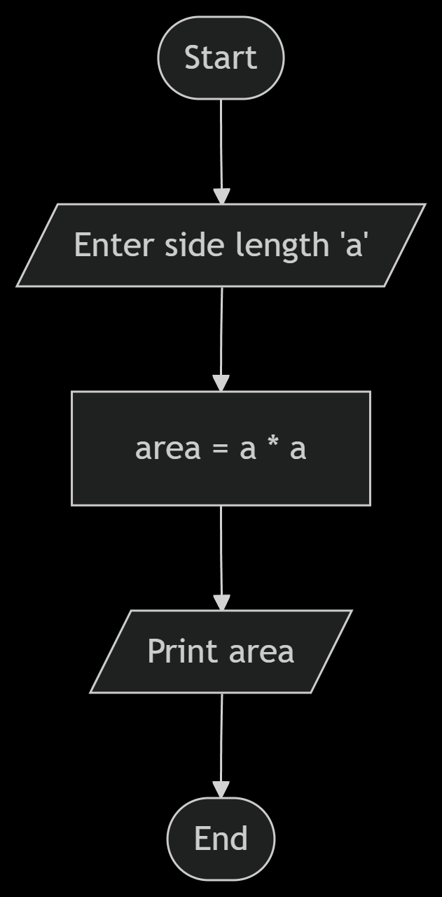

# Area of A Square : side_a

## How to solve a problem:
1. Understand the problem.
   - Find the area of a square with side length `side_a`.
2. Find input.
   - Find the length of the side of the square, `side_a`.
3. Find solution.
   - Area = side_a * side_a. (This is the mathematical operation to find the area.)
4. Convert solution to code.
   - Use a programming language to implement the solution.

## Flowchart
   

## Pseudocode
1. Input side_a.
2. Area = side_a * side_a.
3. Print area.
4. End.