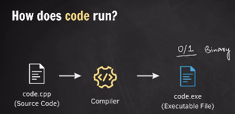
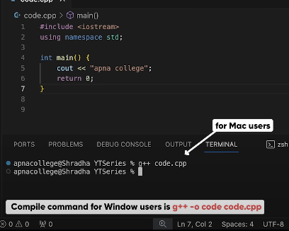
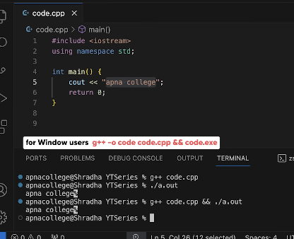

## How does code run?


## Building a C++ Program using G++

In compiler 
| Operating System | Executable File Name |
|------------------|----------------------|
|      Windows     |       file.exe       |
|      macOS       |       file.out       |


## Running a C++ Program using G++

In terminal (compile - execution)
- In Mac
    ```bash
    g++ file.cpp
    ./a.out
    ```
    or
    ```bash
    g++ file.cpp && ./a.out
    ```

- In Windows (cmd)
    ```bash
    g++ -o file file.cpp
    file.exe
    ```
    or
    ```bash
    g++ -o file file.cpp && file.exe
    ```

- In Windows (PowerShell)
    ```bash
    g++ -o file file.cpp
    file.exe
    ```
    or
    ```bash
    g++ -o file file.cpp; if ($?) { file.exe }
    ```

## Data Types
 1 byte = 8 bits

| Data Type   | Size (Bytes) |
|-------------|--------------|
| `int`       | 4            |
| `char`      | 1            |
| `float`     | 4            |
| `double`    | 8            |
| `bool`      | 1            |
| `long`      | 4            |
| `long long` | 8            |
| `short`     | 2            |
| `string`    | 24-32        |
| `pointer`   | 8            |

## Operators
- Arithmetic Operators
  - `+` (addition) 
  - `-` (subtraction)
  - `*` (multiplication)
  - `/` (division)
  - `%` (modulus)
- Relational Operators
  - `==` (equal to)
  - `!=` (not equal to)
  - `>` (greater than)
  - `<` (less than)
  - `>=` (greater than or equal to)
  - `<=` (less than or equal to)
- Logical Operators
  - `&&` (logical AND)
  - `||` (logical OR)
  - `!` (logical NOT)

## Unary Operators
- `++` (increment)
- `--` (decrement)a