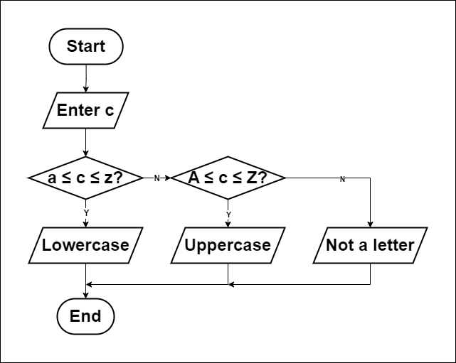

# Find Character Lowercase or Uppercase?
## How to solve a problem:
1. Understand the problem.
   - Determine if a character is lowercase or uppercase.
2. Find input.
   - Enter a character (a-z, A-Z).
3. Find solution.
   - If the character is between 'a' and 'z', it is lowercase.
   - If the character is between 'A' and 'Z', it is uppercase.
   - If the character is not in either range, it is neither.
4. Convert solution to code.
   - Use a programming language to implement the solution.
  
## Flowchart

## Pseudocode
1. Input `character`.
2. If `character` is between 'a' and 'z':
      - Output "Lowercase"
   
   Else If `character` is between 'A' and 'Z':
      - Output "Uppercase"
   
   Else:
      - Output "Neither"
3. End.