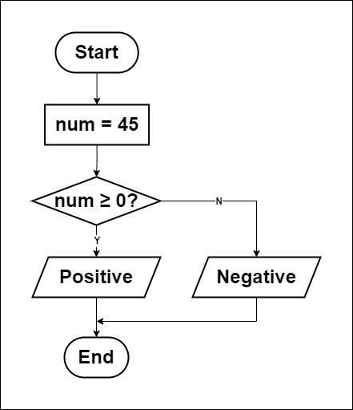

# Check a number is Positive, Negative?

## How to solve a problem:
1. Understand the problem.
   - Determine if a number is positive, negative.
2. Find input.
   - Enter a number (integer).
3. Find solution.
   - If the number bigger and equal to 0, it is positive.
   - If the number smaller than 0, it is negative.
4. Convert solution to code.
   - Use a programming language to implement the solution.

## Flowchart

## Pseudocode
1. Input `number`.
2. If `number` is bigger and equal to 0:
       - Output "Positive"
   
   Else If `number` is smaller than 0:
       - Output "Negative"
   
   Else:
       - Output "Neither"
3. End.